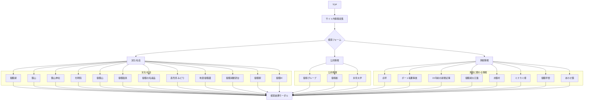

# 本ファイルについて

ユーザが本 ARG を行う上で想定されるケースをフローチャート化したもの。
現状実装の過不足問わず、こちらが最終的なシナリオになる。

---

```mermaid
graph TD

    A[TOP]
        --> B[サイト内情報収集]

    B --> C{検索フォーム}

    C --> C1[文化/社会]
    C --> C2[公的情報]
    C --> C3[真相情報]

    %% -------------------
    %% 文化/社会
    %% -------------------

    subgraph "文化/社会"
        D[御鏡湖]
        E[鏡山]
        F[鏡山神社]
        G[光明院]
        H[御鏡山]
        I[御鏡温泉]
        J[御鏡の名産品]
        K["直売所 みどり"]
        L["地酒 御鏡蔵"]
        M[御鏡湖展望台]
        N[御鏡駅]
        O[御鏡IC]
    end

    %% -------------------
    %% 公的情報
    %% -------------------

    subgraph "公的情報"
        P[御影グループ]
        Q["御影創"]
        R[永帝大学]
    end

    %% -------------------
    %% 真相情報
    %% -------------------

    subgraph "真相に関わる情報"
        S[点呼]
        T[ボート転覆事故]
        U[15年前の新聞記事]
        V[御鏡湖大氾濫]
        W[水鏡村]
        X[ミナカミ様]
        Y["御鏡早雲"]
        Z[あわせ鏡]
    end

    %% -------------------
    %% カテゴリ接続
    %% -------------------

    C1 --> D
    C1 --> E
    C1 --> F
    C1 --> G
    C1 --> H
    C1 --> I
    C1 --> J
    C1 --> K
    C1 --> L
    C1 --> M
    C1 --> N
    C1 --> O

    C2 --> P
    C2 --> Q
    C2 --> R

    C3 --> S
    C3 --> T
    C3 --> U
    C3 --> V
    C3 --> W
    C3 --> X
    C3 --> Y
    C3 --> Z

    %% -------------------
    %% モーダル
    %% -------------------

    AA[検索結果モーダル]

    D --> AA
    E --> AA
    F --> AA
    G --> AA
    H --> AA
    I --> AA
    J --> AA
    K --> AA
    L --> AA
    M --> AA
    N --> AA
    O --> AA

    P --> AA
    Q --> AA
    R --> AA

    S --> AA
    T --> AA
    U --> AA
    V --> AA
    W --> AA
    X --> AA
    Y --> AA
    Z --> AA
```
